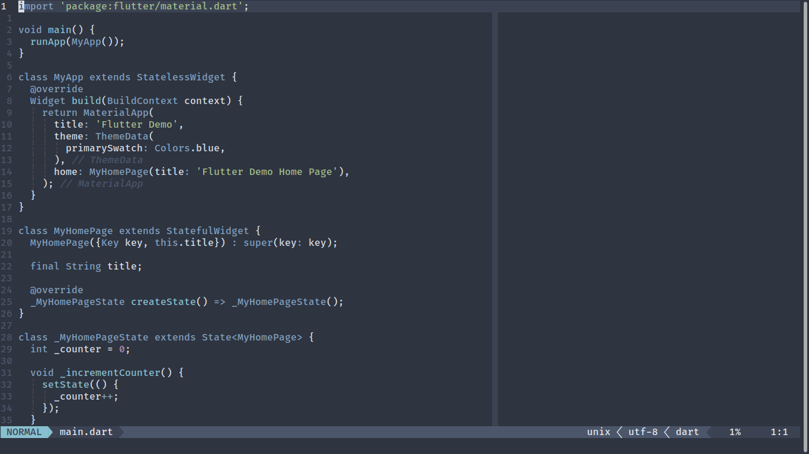
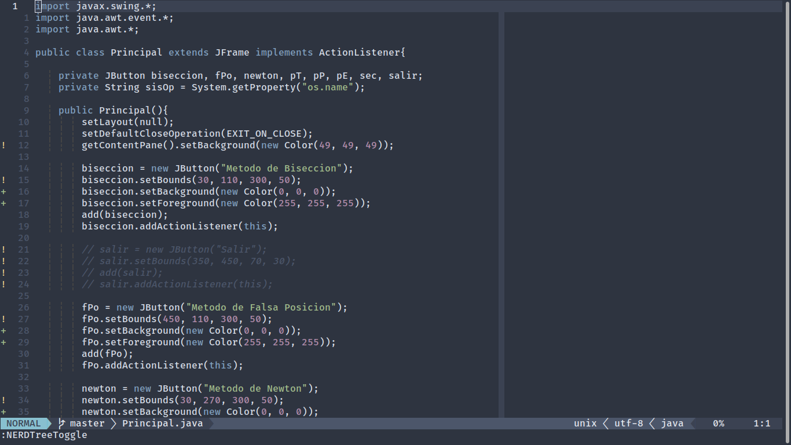

# Configuración de [Neovim](neovim.io) para Linux (Ubuntu)

## Screenshot




# Configuración de [Neovim](https://neovim.io)

## Instalación

0. Crear carpeta ```.config/```

```sh
mkdir .config
```

```sh
cd .config/
```

1. Instalar [vim-plug](https://github.com/junegunn/vim-plug)
para [Neovim](https://neovim.io) en sistema Unix, Linux

```sh
sh -c 'curl -fLo "${XDG_DATA_HOME:-$HOME/.local/share}"/nvim/site/autoload/plug.vim --create-dirs \
       https://raw.githubusercontent.com/junegunn/vim-plug/master/plug.vim'
```

2. Instalar [nodejs](https://nodejs.org/en/download/) para
el soporte de [COC](https://github.com/neoclide/coc.nvim/)

```sh
curl -sL install-node.now.sh/lts | bash
```

3. Clona el repositorio en la carpeta ```.config/```

```sh
git clone https://github.com/mikenavarroro/nvim.git
```

4. Instalar los paquetes de COC (Opcional)

```sh
nvim
```

```
:PlugInstall
```

```
:CocInstall coc-clangd coc-css coc-emmet coc-flutter
coc-html coc-html-css-support coc-java coc-jedi coc-json
coc-python coc-snippets coc-sql coc-tabnine coc-tsserver
```
